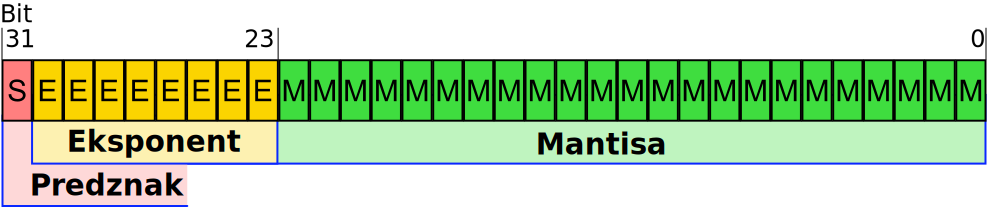

# 2. Seštevanje celih števil, Zapis v plavajoči vejici

- [2. Seštevanje celih števil, Zapis v plavajoči vejici](#2-se%c5%a1tevanje-celih-%c5%a1tevil-zapis-v-plavajo%c4%8di-vejici)
  - [Seštevanje celih števil](#se%c5%a1tevanje-celih-%c5%a1tevil)
  - [Zapis realnih števil s plavajočo vejico](#zapis-realnih-%c5%a1tevil-s-plavajo%c4%8do-vejico)

## Seštevanje celih števil

* ### Prenos in pravilnost rezultata pri seštevanju **nepredznačenih števil**

    Pravilnost rezultata pri seštevanju nepredznačenih števil določa prenos (*ang. carry*) na najpomembnejšem bitu $C_{MSB}$. Če je prenos $C_{MSB}$ enak 0, je rezulat pravilen. Če je prenos 1, je rezultat nepravilen. V tem primeru se rezultata ne da predstaviti z danim številom bitov. Torej:

    $$
   
    C_{MSB} = 
    \left\{\begin{matrix}
    0, &    Rezultat \: seštevanja \: je \:pravilen\\ 
    1, &    Rezultat \: seštevanja \: ni \: pravilen
    \end{matrix}\right. \quad,

    $$

    * **Primer**: Opazujte prenos pri seštevanju 190 in 70 :

        Najprej pretvorimo števili v dvojiški sistem:

        $$
        \begin{aligned}
        190_{(10)}=128+32+16+8+4+2 \rightarrow 1011\:1110_{(2)}     
        \end{aligned} \\
        \begin{aligned}
        70_{(10)}=64+4+2 \rightarrow 0100\:0110_{(2)}     
        \end{aligned}
        $$ 

        Seštejemo binarni števili po modulu 2 (1+1 = 0 -> prenos v naslednji bit enak 1)
        $$
        \begin{aligned}
        1011\:1110&\\
        +\quad 0100\:0110&\\
        \hline\\[-3pt]
        C_{MSB}=1\quad 0000\:0010&
        \end{aligned}\\[10pt]
         $$

        $C_{MSB}$ je enak 1, torej rezultat  ni pravilen.      
* ### Prenos in pravilnost rezultata pri seštevanju **predznačenih števil**

    Veljavnost rezultat pri seštevanju predznačenih števil določa bit preliva (*ang. overflow*) $V$. Če sta oba znaka seštevancev enaka in je znak rezultata različen potem je $V$ enak 1 ter je rezultat nepravilen. Drugače pa je $V=0$ in je rezultat pravilen. To lahko predstavimo z naslednjo tabelo : 

    
    |  op1 | op2 |   rez    |$V$| 
    |------|-----|----------|---|
    |   +  |    -|  + / -   | 0 |           
    |   -  |    +|  + / -   | 0 | 
    |   +  |    +|    +     | 0 | 
    |   +  |    +|    -     | 1 | 
    |   -  |    -|    -     | 0 | 
    |   -  |    -|    +     | 0 | 

    $$
   
    V = 
    \left\{\begin{matrix}
    0, &    Rezultat \: seštevanja \: pravilen\\ 
    1, &    Rezultat \: seštevanja \: ni \: pravilen
    \end{matrix}\right. \quad,

    $$

    * **Primer**: Opazujte prenos pri seštevanju 123 in (-123) :
  
        Pretvorba v dvojiški sistem (Dvojiški komplement):

        $$
        \begin{aligned}
        124_{(10)} \rightarrow 0111\:1100_{(2)}     
        \end{aligned} \\
        \begin{aligned}
        -123_{(10)} \rightarrow 1000\:0101_{(2)}     
        \end{aligned}
        $$ 

        Seštejemo po modulu 2 

        $$
        \begin{aligned}
        0111\:1100&\\
        +\quad 1000\:0101&\\
        \hline\\[-3pt]
        C_{MSB}=1\quad 0000\:0001&
        \end{aligned}\\[10pt]
         $$

        Seštevanca in rezultat so pozitivni -> $V=0$ -> Rezultat je pravilen čeprav je $C_{MSB} = 1$. Pri seštevanju predznačenih števil upoštevamo samo bit preliva $V$.

    * **Primer**: Opazujte prenos pri seštevanju -80 in (-60) :

        Pretvorba v dvojiški sistem (Drugi komplement):

        $$
        \begin{aligned}
        -80_{(10)} \rightarrow 1011\:0000_{(2)}     
        \end{aligned} \\
        \begin{aligned}
        -60_{(10)} \rightarrow 1100\:0100_{(2)}     
        \end{aligned}
        $$ 

        Seštejemo po modulu 2 

        $$
        \begin{aligned}
        1011\:0000&\\
        +\quad 1100\:0100&\\
        \hline\\[-3pt]
        C_{MSB}=1\quad 0111\:0100&
        \end{aligned}\\[10pt]
         $$

        Seštevanci sta pozitivna, rezultat je negativen -> $V=1$ -> Rezultat je nepravilen.

## Zapis realnih števil s plavajočo vejico

Zapis s plavajočo vejico v formatu IEEE 754 uporabljamo za predstavitev realnih števil v računalništvu. Obstajaja več formatov zapisov števil v plavajoči vejici. Najpogostojše se uporabljata dva zapisa: 

- IEEE 754 z enojno natančnostjo (podatkovni tip *float* - 32 bitov):

  1. Znak - 1 bit 
  2. Eksponent - 8 bitov
  3. Mantisa - 23 bitov

    

- IEEE 754 z dvojno natančnostjo (podatkovni tip *double* -  64 bitov):

  1. Znak - 1 bit 
  2. Eksponent - 11 bitov
  3. Mantisa - 52 bitov

    

  * Primer: Število –210,5937510 najprej zapišimo v binarni
obliki s plavajočo vejico, nato pa še šestnajstiško v
prestavitvi IEEE 754 z enojno natančnostjo.

    $$
    \begin{aligned}
    –210,5937510_{(10)} \rightarrow ?_{(IEEE 754 \: z \: enojno \: natančnostjo)}     
    \end{aligned} \\
    $$ 

    Postopek:

    1. Pretvorba v **dvojiški sistem**:
        $$
            \begin{aligned}
             –210,5937510_{(10)} \rightarrow -1101\:0010,1001\:1_{(2)}     
            \end{aligned} \\
        $$    

         To ni IEEE 754 zapis !!!!
    2. Normalizacija -> Pretvorimo v  zapis ($1,m\cdot2^e$)
        $$
            \begin{aligned}
             -1101\:0010,1001\:1 = - 1,1010\:0101\:0011 \cdot 2^{7}    
            \end{aligned} \\
        $$    

        pri čemer:
         - $m = 1010\:0101\:0011$, 
         - $e = 7$

    3. Zapis v IEEE 754 z enojno natačnostjo
        - Predznak: Število je negativno $\rightarrow$ $s = 1_{(2)}$ 
        - Eksponent: $E = e + 127 = 134_{(10)} \rightarrow 1000\:0110_{(2)}$
        - Mantisa: $m = 1010\:0101\:0011\:0000\:0000\:000_{(2)}$
  
    4. Rešitev:

       $1 \:  1000\:0110 1010\:0101\:0011\:0000\:0000\:000_{IEEE754} =0\texttt{x}C352\:9800_{IEEE754}$  

  * Primer: Število $0\texttt{x}BF580000$ je zapisano v IEEE 754 z enojno
natančnostjo. Zapišimo desetiško vrednost.

    $$
    \begin{aligned}
    0\texttt{x}BF580000_{(IEEE 754 \: z \: enojno \: natančnosti)}     
    \end{aligned} \rightarrow ?_{(10)} \\
    $$    

    Zapišimo podano število v dvojiškem sistemu:

    $$0\texttt{x}BF580000 = \underbrace{1}_{Predznak}\overbrace{011\:1111\:0}^{Eksponent}\underbrace{101\:1000\:0000 \cdot \cdot  \cdot 0}_{Mantisa}$$

    - Predznank
        * $s=1 \rightarrow$ Število je negativno
    - Eksponent
        * $E = 126 \rightarrow e=E-127=-1$ 
    - Mantisa 
        - $m = 1011$
    - Končni rezultat
        - $$
            \begin{aligned}
             (-1)^s\cdot1,m\cdot2^e=-1.1011_{2}\cdot2^{-1} =-0,84375
            \end{aligned} 
          $$      