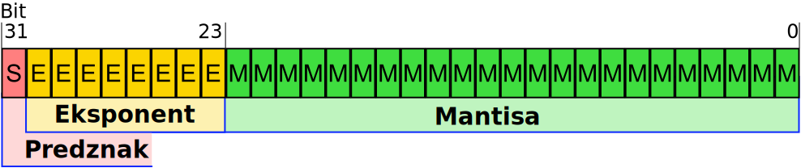

# 2. Seštevanje celih števil, zapis v plavajoči vejici

- [2. Seštevanje celih števil, zapis v plavajoči vejici](#2-se%c5%a1tevanje-celih-%c5%a1tevil-zapis-v-plavajo%c4%8di-vejici)
  - [Seštevanje celih števil](#se%c5%a1tevanje-celih-%c5%a1tevil)
  - [Zapis realnih števil s plavajočo vejico](#zapis-realnih-%c5%a1tevil-s-plavajo%c4%8do-vejico)

## Seštevanje celih števil

* ### Prenos in pravilnost rezultata pri seštevanju **nepredznačenih števil**

    Pravilnost rezultata pri seštevanju nepredznačenih števil določa prenos (*ang. carry*) na najpomembnejšem bitu $C_{MSB}$. Če je prenos $C_{MSB}$ enak 0, je rezulat pravilen. Če je prenos 1, je rezultat nepravilen. V tem primeru se rezultata ne da predstaviti z danim številom bitov. Torej:

    $$
   
    C_{MSB} = 
    \left\{\begin{matrix}
    0, &    Rezultat \: seštevanja \: je \:pravilen\\ 
    1, &    Rezultat \: seštevanja \: ni \: pravilen
    \end{matrix}\right. \quad,

    $$

    * **Primer**: Opazujte prenos pri seštevanju 190 in 20 :

        Najprej pretvorimo števili v dvojiški sistem:

        $$
        \begin{aligned}
        190_{(10)}=128+32+16+8+4+2 \rightarrow 1011\:1110_{(2)}     
        \end{aligned} \\
        \begin{aligned}
        20_{(10)}=16+4 \rightarrow 0001\:0100_{(2)}     
        \end{aligned}
        $$ 

        Seštejemo binarni števili po modulu 2 (1+1 = 0 -> prenos v naslednji bit je 1)
        $$
        \begin{aligned}
        1011\:1110&\\
        +\quad 0001\:0100&\\
        \hline\\[-3pt]
        C_{MSB}=0\quad 1101\:0010&
        \end{aligned}\\[10pt]
         $$

        $C_{MSB}$ je enak 0, torej je rezultat pravilen. 

* ### Prenos in pravilnost rezultata pri seštevanju **predznačenih števil**

    Veljavnost rezultat pri seštevanju predznačenih števil določa bit preliva (*ang. overflow*) $V$. Če sta oba predznaka seštevancev enaka in je predznak rezultata različen, potem je $V$ enak 1 in je rezultat nepravilen. Drugače pa je $V=0$ in je rezultat pravilen. To lahko predstavimo z naslednjo tabelo: 

    
    |  op1 | op2 |   rez    |$V$| 
    |------|-----|----------|---|
    |   +  |    -|  + / -   | 0 |           
    |   -  |    +|  + / -   | 0 | 
    |   +  |    +|    +     | 0 | 
    |   +  |    +|    -     | 1 | 
    |   -  |    -|    -     | 0 | 
    |   -  |    -|    +     | 1 | 

    $$
   
    V = 
    \left\{\begin{matrix}
    0, &    \text{Rezultat seštevanja  je pravilen}\\ 
    1, &    \text{Rezultat seštevanja  ni pravilen}
    \end{matrix}\right. \quad,

    $$

    * **Primer**: Opazujte prenos pri seštevanju 123 in (-123) :
  
        Pretvorba v dvojiški sistem (Dvojiški komplement):

        $$
        \begin{aligned}
        124_{(10)} \rightarrow 0111\:1100_{(2)}     
        \end{aligned} \\
        \begin{aligned}
        -123_{(10)} \rightarrow 1000\:0101_{(2)}     
        \end{aligned}
        $$ 

        Seštejemo po modulu 2 

        $$
        \begin{aligned}
        0111\:1100&\\
        +\quad 1000\:0101&\\
        \hline\\[-3pt]
        C_{MSB}=1\quad 0000\:0001&
        \end{aligned}\\[10pt]
         $$

        Seštevanca in rezultat so pozitivni -> $V=0$ -> Rezultat je pravilen, čeprav je $C_{MSB} = 1$. Pri seštevanju predznačenih števil upoštevamo samo bit preliva $V$.
 
    * **Primer**: Opazujte prenos pri seštevanju -80 in (-60) :

        Pretvorba v dvojiški sistem (dvojiški komplement):

        $$
        \begin{aligned}
        -80_{(10)} \rightarrow 1011\:0000_{(2)}     
        \end{aligned} \\
        \begin{aligned}
        -60_{(10)} \rightarrow 1100\:0100_{(2)}     
        \end{aligned}
        $$ 
        
        Seštejemo po modulu 2 

        $$
        \begin{aligned}
        1011\:0000&\\
        +\quad 1100\:0100&\\
        \hline\\[-3pt]
        C_{MSB}=1\quad 0111\:0100&
        \end{aligned}\\[10pt]
         $$

        Seštevanca sta pozitivna, rezultat je negativen -> $V=1$ -> Rezultat je nepravilen.

    * **Naloge**: Opazujte prenos, preliv in pravilnost rezultata pri seštevanju naslednjih 8-bitnih števil:
        *  nepredznačeni števili 190 in 70 :

            Pretvorba v dvojiški sistem:

            $$
            \begin{aligned}
            190_{(10)} \rightarrow 1011\:1110_{(2)}     
            \end{aligned} \\
            \begin{aligned}
            \quad70_{(10)} \rightarrow 0100\:0110_{(2)}     
            \end{aligned}
            $$ 

            Seštejemo števili v dvojiškem zapisu po modulu 2 
            $$
            \begin{aligned}
            1011\:1110&\\
            +\quad 0100\:0110&\\
            \hline\\[-3pt]
            C_{MSB}=1\quad 0000\:0100&
            \end{aligned}\\[10pt]
            $$

            $C_{MSB}$ je enak 1, torej rezultat ni pravilen. 

        * predznačeni števili v dvojiškem komplementu 124 in 7
            Pretvorba v dvojiški sistem:

            $$
            \begin{aligned}
            124_{(10)} \rightarrow 0111\:1100_{(2)}     
            \end{aligned} \\
            \begin{aligned}
            \quad7_{(10)} \rightarrow 0000\:0111_{(2)}     
            \end{aligned}
            $$ 

            Seštejemo števili v dvojiškem zapisu po modulu 2 
            $$
            \begin{aligned}
            0111\:1100&\\
            +\quad 0000\:0111&\\
            \hline\\[-3pt]
            C_{MSB}=0\quad 1000\:0011&
            \end{aligned}\\[10pt]
            $$

            Seštevanca sta pozitivna, rezultat je negativen -> $V=1$ -> Rezultat je nepravilen.
      
        * predznačeni števili v dvojiškem komplementu -80 in 60
  
            Pretvorba v dvojiški sistem:

            $$
            \begin{aligned}
            -80_{(10)} \rightarrow 1011\:0000_{(2)}     
            \end{aligned} \\
            \begin{aligned}
            \quad60_{(10)} \rightarrow 0011\:1100_{(2)}     
            \end{aligned}
            $$ 
             
             
             
             
             
             

            Seštejemo števili v dvojiškem zapisu po modulu 2 (1+1 = 0 -> prenos v naslednji bit je 1)
            $$
            \begin{aligned}
            1011\:0000&\\
            +\quad 0011\:1100&\\
            \hline\\[-3pt]
            C_{MSB}=0\quad 1110\:1100&
            \end{aligned}\\[10pt]
            $$

            Predznaka seštevancev sta različna -> $V=0$ -> Rezultat je pravilen.
    * **Naloga iz izpita 1**  Imamo podani naslednji števili: 

      * $A = 0\texttt{x}0A63\quad$ 16-bitno predznačeno celo število v zapisu z dvojiškim komplementom
      * $B=\quad0\texttt{x}F4\quad$  8-bitno predznačeno celo število v zapisu z dvojiškim komplementom

      Izračunajte $E = A + (-B)$. Ali je pri seštevanju prišlo do prenosa ali preliva? Število $B$ najprej pretvorite v 16-bitno predznačeno celo število. Rezultat $E$ zapišite v šestnajstiški obliki kot 16-bitno predznačeno celo število v dvojiškem komplementu.

      **Rešitev**:

      Najprej predstavimo število $B$ kot 16-bitno :

       $$B =????\:????\:\overbrace{1111\:0100}^{0\texttt{x}F4}$$

       Ker je $B$ predznačeno število, namesto zgornjih bitov vstavimo bit predznaka, oziroma razširimo $B$ z bitom predznaka. Ker je $B$ negativno število, namesto $?$ podamo $1$. Torej:

       $$B =1111\:1111\:{1111\:0100}=0\texttt{x}FFF4$$

       Izračunamo $-B$

       $$-B = \lnot (B)+1 = 0000\:0000\:0000\:1100 $$  
    
        pri čemer $\lnot (\cdot)$ pomeni negacijo bitov ($1 -> 0$, $0 -> 1$). Na koncu seštejemo $A + (-B)$

        $$E = A+(-B) = 0000\:1010\:0110\:1111_{(2)} = 0\texttt{x}0A6F_{(16)} $$  

        Seštevanca $A$ in $(-B)$ ter rezultat $E$ so pozitivni $\rightarrow$ Rezultat je pravilen.

#

## Zapis realnih števil s plavajočo vejico

Zapis s plavajočo vejico v formatu IEEE 754 v računalništvu uporabljamo za predstavitev realnih števil. Obstajaja več formatov zapisov števil v plavajoči vejici. Najpogostojše se uporabljata dva zapisa: 

- IEEE 754 z enojno natančnostjo (podatkovni tip *float* - 32 bitov):

  1. Predznak - 1 bit 
  2. Eksponent - 8 bitov
  3. Mantisa - 23 bitov

    

- IEEE 754 z dvojno natančnostjo (podatkovni tip *double* -  64 bitov):

  1. Predznak - 1 bit 
  2. Eksponent - 11 bitov
  3. Mantisa - 52 bitov

    

  * **Primer**: Število –210,5937510 najprej zapišimo v dvojiški obliki s plavajočo vejico, nato pa še šestnajstiško v prestavitvi IEEE 754 z enojno natančnostjo.

    $$
    \begin{aligned}
    –210,5937510_{(10)} \rightarrow ?_{(IEEE 754 \: z \: enojno \: natančnostjo)}     
    \end{aligned} \\
    $$ 

    Postopek:

    1. Pretvorba v **dvojiški sistem**:
        $$
            \begin{aligned}
             210,5937510_{(10)} \rightarrow 1101\:0010,1001\:1_{(2)}     
            \end{aligned} \\
        $$    

         To ni IEEE 754 zapis !!!!
    2. Dvojiška eksponentna oblika -> Pretvorimo v zapis ($1,m\cdot2^e$)
        $$
            \begin{aligned}
             1101\:0010,1001\:1 =  1,1010\:0101\:0011 \cdot 2^{7}    
            \end{aligned} \\
        $$    

        pri čemer:
         - $m = 1010\:0101\:0011$, 
         - $e = 7$

    3. Zapis v IEEE 754 z enojno natačnostjo
        - Predznak: Število je negativno $\rightarrow$ $s = 1_{(2)}$ 
        - Eksponent: $E = e + 127 = 134_{(10)} \rightarrow 1000\:0110_{(2)}$
        - Mantisa: $m = 1010\:0101\:0011\:0000\:0000\:000_{(2)}$
  
    4. Rešitev:

        $$ \underbrace{1}_{Predznak}\overbrace{100\:0011\:0}^{Eksponent}\underbrace{101\:0010\:1001\:1000\:0000\:0000}_{Mantisa} = 0\texttt{x}C352\:9800$$
  * **Primer**: Število $0\texttt{x}BF580000$ je zapisano v IEEE 754 z enojno
natančnostjo. Zapišimo desetiško vrednost.

    $$
    \begin{aligned}
    0\texttt{x}BF580000_{(IEEE 754 \: z \: enojno \: natančnosti)}     
    \end{aligned} \rightarrow ?_{(10)} \\
    $$    

    Zapišimo podano število v dvojiškem sistemu:

    $$0\texttt{x}BF580000 = \underbrace{1}_{Predznak}\overbrace{011\:1111\:0}^{Eksponent}\underbrace{101\:1000\:0000 \cdot \cdot  \cdot 0}_{Mantisa}$$

    - Predznank
        * $s=1 \rightarrow$ Število je negativno
    - Eksponent
        * $E = 0111 \: 1110_{(2)} \rightarrow 126_{(10)} \Rightarrow e=E-127=-1$ 
    - Mantisa 
        - $m = 1011$
    - Končni rezultat
        - $$
            \begin{aligned}
             (-1)^s\cdot1,m\cdot2^e=-1.1011_{2}\cdot2^{-1} =-0,84375
            \end{aligned} 
          $$      

* **Naloga**: V šestnajstiškem sestavu zapišite število –87,421875 v zapis IEEE 754 z enojno natančnostjo. 

    **Rešitev**:

  1. Pretvorba v **dvojiški sistem**:
      $$
          \begin{aligned}
           87,421875_{(10)} \rightarrow 0101\:0111,\:0110\:1100_{(2)}     
          \end{aligned} \\
      $$    
  2. Dvojiška eksponentna oblika -> Pretvorimo v  zapis ($1,m\cdot2^e$)
      $$
          \begin{aligned}
           0101\:0111,\:0110\:11 = 1,\:0101\:1101\:1011 \cdot 2^{6}    
          \end{aligned} \\
      $$    

  3. Zapis v IEEE 754 z enojno natančnostjo
      - Predznak: Število je negativno $\rightarrow$ $s = 1_{(2)}$ 
      - Eksponent: $E = e + 127 = 133_{(10)} \rightarrow 1000\:0101_{(2)}$
      - Mantisa: $m =0101\:1101\:1011_{(2)}$

  4. Rešitev:

     $1 \:  1000\:0101 \: 0101\:1101\:1011\:0000\:0000\:000_{IEEE754} =0\texttt{x}C2AE\:D800_{IEEE754}$  

* **Naloga**: Zapišite pozitivno neskončno vrednost v šestnajstiškem zapisu v IEEE 754 z dvojno natančnostjo.

    **Rešitev**: Poglejte prosojnice iz predavanj
    
    $+ \infty \rightarrow 0\texttt{x}7FF0\:0000\:0000\:0000_{IEEE 754 \: z \: dvojno \: natančnostjo}$ 
    
    $- \infty \rightarrow 0\texttt{x}FFF0\:0000\:0000\:0000_{IEEE 754 \: z \: dvojno \: natančnostjo}$ 

* **Naloga**: Katero desetiško vrednost predstavlja $0\texttt{x}FFF1\:0000\:0000\:0000$ v IEEE 754 z dvojno natančnostjo?
 
    **Rešitev**: Poglejte prosojnice iz predavanja
    
    $0\texttt{x}FFF1\:0000\:0000\:0000_{IEEE 754 \: z \: dvojno \: natančnosti} \rightarrow NaN$ 
    
* **Naloga iz izpita 2**: Imamo podani naslednji števili:

  * $C=0\texttt{x}3F58\:0000\quad$ 32-bitno število, zapisano po standardu IEEE 754
  * $D=0\texttt{x}425C\:4000\quad$ 32-bitno število, zapisano po standardu IEEE 754

  Izračunajte $F = C + D$. Zapišite števili $C$ in $D$ v dvojiški eksponentni obliki (primer: $1,1001011 \cdot 2^{-10}$). Število $F$ mora biti zapisano na oba načina – v dvojiški eksponentni obliki in šestnajstiško po formatu IEEE 754.

  **Rešitev**:
  
  * Zapišemo podani števili v dvojiški eksponentni obliki

  $$C=0\texttt{x}3F58\:0000 \rightarrow 1,1011\cdot 2^{-1}$$
  $$D=0\texttt{x}425C\:4000 \rightarrow 1,101110001 \cdot 2^{5}$$

  * Števili prestavimo na isto potenco
  $$C= 1,1011\cdot 2^{-1}$$
  $$D= 1101110,0010\cdot 2^{-1}$$

  * Števili seštejemo in premaknemo vejico
  $$ F= C+D = 1,1011111101 \cdot 2^5$$

  * Zapišemo v IEEE 754
  $$ F= 0\texttt{x}425F\:A000$$

* **Naloga iz izpita 3**: Izračunajte produkt $P = M \cdot N$ dveh realnih števil, zapisanih v 32-bitnem zapisu v plavajoči vejici po standardu IEEE 754. Števila pred množenjem zapišite v dvojiški eksponentni obliki brez odmika (primer:  $+1,011\cdot2^{-32}$). Množenje izvedite v dvojiški obliki. Rezultat P zapišite po standardu IEEE 754 v šestnajstiškem zapisu.
  * $M=0\texttt{x}ABCD\:0000\quad$ 
  * $N\,=0\texttt{x}4EB0\:0000\quad$ 
 
 
   **Rešitev**:

     * Zapišemo podani števili v dvojiški eksponentni obliki

  $$M=0\texttt{x}ABCD\:0000 \rightarrow -1,1001101\cdot 2^{-40}$$
  $$N=0\texttt{x}4EB0\:0000 \rightarrow 1,1011 \cdot 2^{30}$$

    * Pomnožimo $M$ in $N$

    $$P = M \cdot N=(-1,1001101)\cdot2^{-40}\cdot  1,1011 \cdot 2^{30}$$  
    $$ = -(1,1001101\cdot  1,1011) \cdot 2^{-40+30}$$  
    $$ = -(1,1001101\cdot  1,1011) \cdot 2^{-10}$$  
    $$ = -(10,0011001111) \cdot 2^{-10}$$  
    $$ = -(1,00011001111) \cdot 2^{-9}$$ 

    

    
    
* Zapišemo v IEEE 754
    $$ P= 0\texttt{x}BB0C\:F000$$
