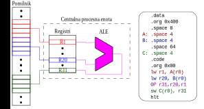

# 3. Procesor HIP: ALE ukazi (1. del)

## Uvod 
Aritmetično logična enota (ALE) lahko izvaja več operacij kot so:

1. Aritmetične operacije: seštevanje (+) in odštevanje (-)
2. Pomiki: v levo (<<), v desno (>>), logični in aritmetični pomik
3. Logične operacije: bitni IN (&), bitni ALI(|), bitni eksluzivni ALI(^), bitna negacija (~)
4. set operacije ali operacije primerjanja: enako (=), različno (!=), večje (>), manjše (<)

V HIP-u so vsi ukazi 3-operandni razen NOT in LHI, ki sta v resnici 2-operandna ter se pri njima eden od treh operandov ignorira. Glede na vrste operandov v ukazu, HIP razlikujeta dve vrsti ukazov:

1. Vsi operandi so registri
2. En od treh operandov je takojšnji operand ali konstantna vrednost. V tem primeru takojšnji operand mora biti vrednost ki se lahko zapiše s 16 biti. Tisto vrsto ukazov lahko razaznamo po črki **I** (angl. *Intermediate*) u naboru ukazov na primer ADDI, SLLI itn.

<!---
| Ukaz          | Pomen        | Opis                                                                        |
|---------------|--------------|-----------------------------------------------------------------------------|
| OP Rd, Rs1, Rs2 | rD <- OP(Rs1,Rs2)  | Prvo se izvaja operacija OP nad registroma Rs1 in Rs2 a potem se rezultat shrani v registar rD |
| OPI Rd, Rs1, TO | rD <- OP(Rs1,TO) |  Prvo se izvaja operacija OPI nad registrom Rs1 in takojšnjim operandom TO a potem se rezultat shrani v registar rD. TO mora biti 16-bitna vrednost. 
-->


ALE ima edino dostop do registrov CPE-e in sam ne more dostopati do pomilnika. Pri uporabi ALE ukazov, podatki za procesiranje se morajo najprej naložiti iz pomilnika v registre. Potem, ALE lahko dostopa do vrednosti v registrih in izvaja ukaze. Na koncu, ALE shrani rezultat ukaza v en od registrov. Shranjen rezultat se lahko vporabi v drugem ALE ukazu ali se shrani v pomilnik. Predhodno opisan postopek lahko ilustriramo s naslednjo sliko. Recimo da HIP mora izvajati program podan na desni strani slike. Na levi strani slike je podana poenostavljana izvedba programa v HIPu. Najprej se podatka na naslovu A in B prenašata iz pomilnika v registra R1 in R20. Potem ALE izvaja ukaz OP nad registri R1 in R20 in shrani rezultat v registar R31. (OP predstavlja poljubni ALE vkaz). Na koncu se rezultat operacije shrani v pomilnik na naslovu C.

<p align="center">
    
</p>


## Aritmetične operacije

V HIP se lahko izvajata samo celoštevilično seštevanje in odštevanje. HIP ne podpira operacij množenja in delenja. Množenje in delenje se lahko implementirata s pomočjo uporabe potprogramov in uporabe podprtih ALE ukazov.  

#### Primeri za aritmetične vkaze

| Ukaz         | Pomen        | Opis                                                                                                  |
|---------------|-------------------|------------------------------------------------------------------------------------------------------------|
| add r1, r2, r3 | r1 <- r2 + r3  | Vrednosti registra r2 se prišteje vrednost  registra r3 in se rezultat seštevanja shrani v registar r1|
| addi r1, r2, 20  | r1 <- r2 + 20|  Vrednosti registra r2 se prišteje število 20 in se rezultat seštevanja shrani v registar r1 |
| sub r1, r2, r3 | r1 <- r2 - r3  | Od vrednosti v registru r2 se odšteje vrednost registra r3 in se rezultat shrani v r1|
| subi r1, r2, 20  | r1 <- r2 - 20| Od vrednosti v registru r2 se odšteje vrednost 20 in se rezultat shrani v r1|

Opomba: Pri ukazih addi in subi takojšnji operand mora biti 16-bitna vrednost. Kaj se zgodi če se vrednost takojšnji operand zapisati sa 16 bitov? Poglejmo naslednji del kode:

```as
...
addi r1,r0,0x12345678
...
```
Po izvajanju ukaza vrednost registra r1 ne bo enaka `0x12345678` ampak bo enaka `0x00005678`. Ukaz addi upošteva samo spodnjih 16 bitov !!!

#### Nepredznačeno seštavanje in odštevanje. 

Ukazi v prejšnjem delu so izvajali predznačeno seštavanje in odštevanje, oziroma ukazi predpostavljajo da so operandi predznačena števila. V HIPu obstajata tudi nepredznačeno seštevanje i odštevanje. Pri nepredznačenem seštevanju (odštevanju) operandi se posmatrajo kot nepredznačena števila. Obstajata dve razliki med predznačenim in nepredznačenim seštevanjem (odštevanjem):

1.  Veljavnost pri predznačenem seštevanju določa bit preliva ($V$) a pri nepredznačenem seštevanju bit prenosa na zadnjem bitu $C_{MSB}$ (2. vaja !!!!)
2.  Pri razširitvi predznaka pri takojšnjem naslavljanju. Pri nepredznačenem seštevanju takojšnji operand se razširja sa ničlami a pri predznačenem sa bitom predznaka. 

#### Primeri za nepredznačene aritmetične vkaze

| Ukaz          | Pomen        | Opis                                                                                                       |
|---------------|--------------|------------------------------------------------------------------------------------------------------------|
| addu r1, r2, r3 | r1 <- r2 + r3  | Nepredznačeno seštavanje registrov r2 in r3 (Opazuj zadnjo črko U u mnemoniku ukaza) |
| addui r1, r2, 20  | r1 <- r2 + 20|  Nepredznačeno seštavanje registra r2 in takojšnjeg operanda|
| subu r1, r2, r3 | r1 <- r2 - r3  |  Nepredznačeno odštevanje registra r3 od registra r2|
| subui r1, r2, 20  | r1 <- r2 - 20|  Nepredznačeno odštevanje takojšnjeg operanda od registra r2|

Prašanje: Koliko znašata registra r1 in r2 po izvajanju naslednjih ukazov?

```as
...
addi r1,r0,-1
addui r2,r0,-1
...
```
Odgovor: r1 = `0xFFFFFFFF` in r2 = `0x0000FFFF`. Namig: Pretvorite (-1) v 16-bitno binarno vrednost v dvojiškem komplementu. 

## Pomiki 

#### Logični pomik v levo in desno

Pomikanje števila v levo strano za $n$ mest je ekvivaletno množenjem tega števila s $2^n$. Oglejmo si primer v katerem 8-bitno število s vrednostjo $3$ pomikamo v levo za dva mesti:

$$
\begin{aligned}
A:\quad 0000\:0011 \rightarrow \,\,3&\\
\hline\\[-3pt]
A << 2:\quad 0000\:1100\rightarrow 12&
\end{aligned}\\[10pt]
$$

Obratno pomikanje števila v desno strano za $n$ mest je ekvivaletno delenjem tega števila s $2^n$. Oglejmo si primer v katerem 8-bitno število s vrednostjo $40$ pomikamo v desno za tri mesta:

$$
\begin{aligned}
B:\quad 0010\:1000 \rightarrow 40&\\
\hline\\[-3pt]
B >> 3:\quad 0000\:0011\rightarrow \,\,5&
\end{aligned}\\[10pt]
$$


#### Primeri za ukaze logičnih pomikov
| Ukaz          | Pomen        | Opis                                                                                                       |
|---------------|--------------|------------------------------------------------------------------------------------------------------------|
| sll r1, r2, r3| r1 <- r2 << r3  | Vrednost registra r2 se pomika r3 mest v levo in se rezultat shrani v registar r1|
| slli r1, r2, 5| r1 <- r2 << 5  | Vrednost registra r2 se pomika 5 mest v levo in se rezultat shrani v registar r1|
| srl r1, r2, r3 | r1 <- r2 >> r3| Vrednost registra r2 se pomika r3 mest v desno in se rezultat shrani v registar r1 |
| srli r1, r2, 5 | r1 <- r2 >> 5| Vrednost registra r2 se pomika 5 mest v desno in se rezultat shrani v registar r1 |

#### Aritmetični pomik v levo in desno

Logični pomik predpostavlja da je pomikana vrednost nepredznačena a aritmetični pomik upošteva predznak pomikane vrednosti. Razlika med aritmetičnim in logičnim pomikom je vidna edino pri pomiku v desno. Na naslednji slici se jasno vidi kaj se zgodi ko pomikamo število $(-4)_{(10)}$ v desno za dve mesti s logičnim in s aritmetičnim pomikom.

<p align="center">
    
</p>

Logični pomik namesto zgornjih bitov vedno vstavlja 0, dokler aritmetični pomik v desno vstavlja bit predznaka. namesto zgornjih bitov V primeru na zgornji sliki, aritmetični pomik vstavlja 1 namesto zgornjih bitov, zato ker je $(-4)_{10}$ negativno število. 

#### Primeri za ukaze aritmetičnih pomikov


| Ukaz          | Pomen        | Opis                                                                                                       |
|---------------|--------------|------------------------------------------------------------------------------------------------------------|
| sla r1, r2, r3| r1 <- r2 << r3 | Aritmetični pomik v levo (Opazuj črko A v mnemoniku)|
| slai r1, r2, 5| r1 <- r2 << 5  | Aritmetični pomik v levo s takojšnjim operandom|
| sra r1, r2, r3 | r1 <- r2 >> r3| Aritmetični pomik v desno (Opazuj črko A v mnemoniku) |
| srai r1, r2, 5 | r1 <- r2 >> 5|  Aritmetični pomik v levo s takojšnjim operandom |


### Primer izvajanja ALE ukazov v zbirnem jeziku HIP
Kako se spreminjajo vrednosti registrov v HIPu pri izvajanju programa?

```as
; Vaja04 primer ALE ukazi
    .data
    .org 0x400
A:  .word 0x40000000

    .code
    .org 0

    addi r2, r0, 0x8000 
    addui r2, r0, 0x8000	
    addi r1, r0, 0x80000000	

    lw r3, A(r0)
    lw r4, A(r0)
    add r5, r3, r4	
    addu r6, r3, r4	

    addi r7, r0, 2	
    slli r7, r7, 1
    slli r7, r7, 1

    addi r7, r0, 16	
    srli r7, r7, 1
    srli r7, r7, 1

    addi r8, r0, #0xFFFE 
    srli r9, r8, #1
    srai r10, r8, #1    

    halt
```
**Rešitev:**

Prvi blok ukazov: 

```as
addi r2, r0, 0x8000 
addui r2, r0, 0x8000	
addi r1, r0, 0x80000000	
```
Prvi ukaz: Ker se izvaja predznačeno seštevanje, HIP bo razširil takojišnji operand `0x8000` s bitom predznaka. Torej, `r2 = r0 + 0xFFFF8000 = 0xFFFF8000`. Ne pozabite  vrednost registra r0 je vedno enaka $0$.

Drugi ukaz: Ker se izvaja nepredznačeno seštevanje, HIP bo razširil takojišnji operand `0x8000` sa ničlami. Torej,  `r2 = r0 + 0x00008000 = 0x00008000`.

Tretji ukaz: Prej smo omenili da takojšnji operand mora biti 16-bitna vrenost, kar ni slučaj v našem primeru. Prevajalnik ne bo javil napake, ampak bo vzel samo spodnjih 16 bitov. Torej `r1 = r0 + 0x0000\:0000 = 0x00000000`.

Drugi blok ukazov: 

```as
lw r3, A(r0)
lw r4, A(r0)
add r5, r3, r4	
addu r6, r3, r4	
```
Prva dva ukaza bosta naložila vrednost na pomilniški lokaciji A v registrih  r3 in r4. Torej, `r3=r4=0x40000000`. V tretjem ukazu se uporablja predznačeno seštevanje. Kaj se zgodi pri seštevanju registrov r3 in r4? 

$$
\begin{aligned}
0100\:0000\:0000\:0000\: \cdot\cdot\cdot\cdot\cdot 0&\\
+\quad 0100\:0000\:0000\:0000\: \cdot\cdot\cdot\cdot\cdot 0&\\
\hline\\[-3pt]
C_{MSB}=0\quad 1000\:0000\:0000\:0000\: \cdot\cdot\cdot\cdot\cdot 0&
\end{aligned}\\[10pt]
$$

Seštevanca sta pozitivna ampak je rezultat negativen, to pomeni da predznačeno seštevanje ni pravilno. Procesor bo sprožil napako zaradi celoštevilske prekoračitve. Četrti ukaz izvaja nepredznačeno seštevanje registrov r3 in r4. Ker je prenos na zadnjem bitu $C_{MSB}$ enak nič, seštevanje je pravilno in procesor ne procesor ne bo sprožil napake. 

Tretji blok ukazov: 

```as
addi r7, r0, 2	
slli r7, r7, 1
slli r7, r7, 1
```
Na koncu izvajanja bloka `r7=0x00000008`.

Četvrti blok ukazov: 

```as
addi r7, r0, 16	
srli r7, r7, 1
srli r7, r7, 1
```
Na koncu izvajanja bloka  `r7=0x00000004`.

Peti blok ukazov: 

```as
addi r8, r0, #0xFFFE 
srli r9, r8, #1
srai r10, r8, #1   
```

Najprej se v r8 naloži vrednost $(-2)_{(10)}$, torej `r8=0xFFFEFFFFE`. Drugi ukaz izvaja logični pomik v desno. Po pomiku bo najvišji bit enak nič, ter je `r9=0x7FFFFFFFFFFFFFFF` = $(2^{30}-1)_{(10)}$. Tretji ukaz izvaja aritmetični pomik v desno. Po pomiku bo najvišji bit bitu predznaka, ter je `r10=0x7FFFFFFFFFFFFFFF` = $(-1)_{(10)}$. Prej opisano lahko predstavimo s naslednjo sliko.


<p align="center">
    
</p>


## Naloge

#### Naloga 4.1 
Od naslova 0x400 naprej se po vrsti nahaja 6 števil:

- STEV1 in STEV2 – 16-bitni števili 2323 in 4343
- STEV3 in STEV4 – 8-bitni števili -127 in 6
- STEV5 in STEV6 – 32-bitni števili 23456 in 43210

Rezervirajte še prostor z oznakami SUM16, MUL, DIV, SUM in DIF. Napišite program, ki:
1. števili na naslovih STEV1 in STEV2 nepredznačeno sešteje in rezultat shrani na naslov SUM16
2. število na naslovu STEV3 množi z 2^(M[STEV4]) in rezultat shrani na naslov MUL
3. število na naslovu STEV3 deli z 32 in rezultat shrani na naslov DIV
4. števili na naslovih STEV5 in STEV6 sešteje ter rezultat shrani na naslov SUM
5. število na naslovu STEV5 odšteje od števila na naslovu STEV6 ter rezultat shrani na naslov DIF

Rešitev: 

```as
		.data
		.org 0x400
STEV1:	.word16 2323
STEV2:	.word16	4343
STEV3:	.byte -127
STEV4:	.byte 6
		.align 4
STEV5:	.word 23456
STEV6:	.word 43210
SUM:	.space 4
DIF:	.space 4
MUL:	.space 4
DIV:	.space 1
		.align 2
SUM16:	.space 2

		.code
		.org 0
		
		lhu r1,STEV1(r0)
		lhu r2,STEV2(r0)
		addu r1,r1,r2
		sh	SUM16(r0),r1
		
		lb r1,STEV3(r0)
		lb r2,STEV4(r0)
		sll r3,r1,r2
		sw MUL(r0),r3
		srai r1,r1,#5
		sb DIV(r0),r1
		
		lw r1,STEV5(r0)
		lw r2,STEV6(r0)
		add r3,r1,r2
		sw SUM(r0),r3
		sub r3,r2,r1
		sw DIF(r0),r3
	
		halt
``` 

#### Naloga 4.2

Napišite program v zbirnem jeziku za procesor HIP, ki izračuna uteženo vsoto dveh 16-bitnih predznačenih števil, po pravilu:

$$ A = 0.125 \cdot A + 0.875 \cdot B$$

Ker HIP nima ukazov za delo s plavajočo vejico, naj program uteženo vsoto izračuna po $A = (A +  7 \cdot B)/8$; 
Namig: $7x = x + 2x + 4x$

Rešitev: 
```as
		; Utezena vsota dveh stevil
		
		.data 
		.org 0x400
A:		.word16 64
B:		.word16 8

		.code
		.org 0	

		lh r1,A(r0)
		lh r2,B(r0)	
							
		; 7B = B + 2B + 4B
		add r4,r1,r2		; TEMP = B + A
		slli r2,r2,1		
		add r4,r4,r2		; TEMP = TEMP + 2B
		slli r2,r2,1
		add r4,r4,r2		; TEMP = TEMP + 4B
		srai r4,r4,3		; TEMP = TEMP/8
		
		sh A(r0),r4
		
		halt
```