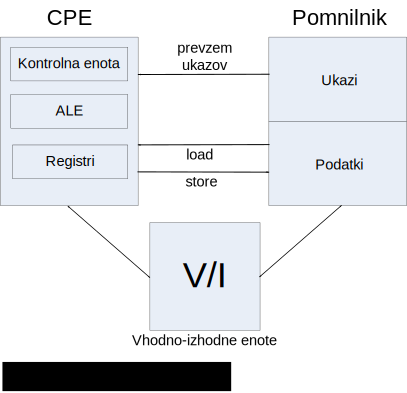
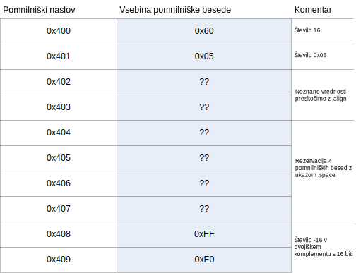
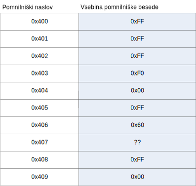

# 3. Procesor HIP: load in store ukazi

Procesor HIP - HIpotetični Procesor, ki ga bomo spoznali pri predmetu, je registrsko-registrski (ang. *load/store*) procesor, kar pomeni, da se morajo operandi nahajati v registrih (ne v pomnilniku), preden lahko nad njimi izvedemo neko operacijo npr. seštevanje. Za prenašanje operandov med pomnilnikom in registri procesorja imamo na voljo ukaze load/store.
<p align="center">
    
</p>

## Pomnilnik
V pomnilniku hranimo programe, ki jih želimo izvesti na procesorju in so sestavljeni iz ukazov in podatkov. Program napišemo v nekem programskem jeziku. V našem primeru bomo za to uporabljali zbirni jezik za procesor HIP. Tako napisan program je potrebno najprej prevesti v strojno kodo, ki jo razume HIP in nato naložiti v pomnilnik. To storimo s pomočjo zbirnika - prevajalnik za zbirni jezik.

Ukazi in podatki so v pomnilku organizirani v pomnilniške besede. Pomnilniška beseda je najmanjše zaporedje bitov, ki ima svoj pomnilniški naslov. V našem primeru je pomnilniška beseda dolga 8 bitov. 

## Ukazi zbirnega jezika za procesor HIP

Ukaze v zbirnem jeziku ločimo v dve skupini: psevdo ukaze in ukaze procesorja HIP.

### Psevdo ukazi
Ti ukazi se ne prevedejo v ukaze, ki jih izvaja procesor, ampak služijo kot navodilo zbirniku. Z njimi opišemo strukturo našega programa in umestimo podatke v pomnilnik. Sintaktično jih prepoznamo po tem, da se vedno začnejo z znakom '.'.
| Psevdo ukaz             | Opis                                                                                                                               |
|-------------------------|------------------------------------------------------------------------------------------------------------------------------------|
| .data                   | Začetek pomnilniškega segmenta s podatki                                                                                 |
| .code                   | Začetek pomnilniškega segmenta z ukazi                                                                                             |
| .org *n*                | Nastavi pomnilniški naslov na *n*                                                                                                  |
| .space *n*              | Rezerviraj *n* bajtov prostora v pomnilniku                                                                                        |
| .byte *n1*, *n2*, ...   | Zapiši 8-bitna cela števila *n1*, *n2*, ... zaporedno v pomnilnik                                                              |
| .word16 *n1*, *n2*, ... | Zapiši 16-bitna cela števila *n1*, *n2*, ... zaporedno v pomnilnik                                                              |
| .word *n1*, *n2*, ...   | Zapiši 32-bitna cela števila *n1*, *n2*, ... zaporedno v pomnilnik                                                                 |
| .align *n*              | V pomnilniku se premakni na naslednji najbližji pomnilniški naslov deljiv z *n*; če je trenutni naslov deljiv z *n*, ne naredi ničesar. |


### Ukazi procesorja HIP
Ti ukazi se prevedejo v strojne ukaze za procesor, ki jih potem, ko zaženemo program, procesor enega za drugim izvaja. Ukazi za procesor HIP so dolgi 32 bitov (štiri pomnilniške besede) in so dveh različnih tipov. Tu si bomo ogledali ukaze load/store, ki so tipa 1 in so namenjeni prenašanju operandov med pomnilnikom in procesorjem.

**Ukazi load/store**

Procesor HIP ima na voljo 32 splošno-namenskih registrov z oznakami r0 do r31, v katere lahko nalagamo operande. Posebnost je le register r0, v katerem je vedno zapisana vrednost 0 in ga ne moremo spreminjati. Vsak register je dolg 32 bitov, torej lahko hranimo v njem 4 pomnilniške besede. Ukazi load/store so sestavljeni na naslednji način:

<p align="center">
    
</p>

**Primeri load/store ukazov**

| Ukaz          | Pomen        | Opis                                                                                                       |
|---------------|--------------|------------------------------------------------------------------------------------------------------------|
| lw r1, 80(r2) | r1<-M[80+2]  | V register r1 naloži vrednost, ki se nahaja v pomnilniku na naslovu (80 + trenutna vrednost v registru r2) |
| sw 70(r2),r1  | M[70+r2]<-r1 | Vrednost, ki se nahaja v registru r1 zapiši v pomnilnik na naslov (70 + trenutna vrednost v registru r2)   |

### Primer programa v zbirnem jeziku za procesor HIP
Kaj se po koncu izvajanja programa nahaja v registru r3?

```as
; Vaja03 primer load/store

      .data
      .org 0x400
A:    .byte 96
B:    .byte 0x05
      .align 4
C:    .space 4
D:    .word16 -16

      .code
      .org 0x0
      lb r1, 0x400(r0)
      sb 0x406(r0), r1
      sb C(r0), r1
      sb C+1(r0), r1
      lb r2, 0x401(r0)
      sb C(r2), r0
      lh r3, D(r0)
      sw A(r0), r3
      lbu r1, B(r0)
      sh C(r0), r1
      lw r3, C(r0)
      halt

```
Zgornji program je razdeljen na dva dela. V prvem delu, ki se začne z psevdo ukazom `.data` definiramo podatke, ki jih bomo uporabili v programu. V drugem delu, ki se začne s psevdo ukazom `.code`, pa sledijo ukazi, ki jih bo izvajal procesor HIP.

Poglejmo si najprej podatkovni del programa. Psevdo ukaz `.org 0x400` je navodilo zbirniku, da naj se postavi na pomnilniški naslov `0x400` (šestnajstiški zapis), kjer se bodo začeli podatki. Sledita psevdo ukaza:
```as
A:    .byte 96
B:    .byte 0x05
```

Ukaza imata tudi oznaki `A` in `B`, ki sta v pomoč programerju, da mu ni treba na pamet vedeti, kje v pomniliku se kaj nahaja, ampak se kasneje v ukazih lahko sklicuje na oznake. Oznake so v zbirniku analogija spremenljivk v višjih programskih jezikih. V bistvu pa samo predstavljajo pomnilniški naslov, na katerem se nahajata neki podatek ali ukaz. Oznaka `A` je v tem primeru ekvivalentna naslovu `0x400` in oznaka `B` naslovu `0x401`. 

Psevdo ukaz `.byte`, ki mu sledi število, zbirniku pove, naj v pomnilniku rezervira 1 bajt prostora (eno pomnilniško besedo) za število in ga zapiše v pomnilnik.

Psevdo ukaz `.align 4` naroči zbirniku, naj se prestavi (če je to potrebno) na naslednji pomnilniški naslov deljiv s 4. V našem primeru to pomeni, da se zbirnik premakne na naslov `0x404` in od tam naprej vpisuje podatke v pomnilnik.

Sledita dva psevdo ukaza:

```as
C:    .space 4
D:    .word16 -16
```

Prvi v pomnilniku samo rezervira štiri zaporedne bajte (pomnilniške besede) prostora. V pomnilnik ne zapiše ničesar. V tako rezerviranem delu pomnilnika se ob začetku izvajanja programa nahajajo naključne vrednosti.

Drugi ukaz v pomnilniku rezervira 16 bitov prostora (dve pomnilniški besedi) in vanj vpiše število -16 (zapis z dvojiškim komplementom).

Ob psevdo ukazih sta tudi oznaki `C` in `D`: prva predstavlja pomnilniški naslov `0x404`, druga pa `0x408`.

Pomnilniška slika podatkovnega dela programa pred začetkom izvajanja:

<p align="center">
    
</p>

Drugi del programa se začne s psevdo ukazoma `.code` in `.org 0x0`. Slednji nas prestavi na pomnilniški naslov `0x0`. Od tu naprej bodo v pomnilniku shranjeni ukazi za procesor HIP. Poglejmo si, kaj vsak od ukazov naredi.

| Ukaz               | Pomen             | Opis                                                                                                     | Rezultat izvajanja                                                                                                                                                                                      |
|--------------------|-------------------|----------------------------------------------------------------------------------------------------------|---------------------------------------------------------------------------------------------------------------------------------------------------------------------------------------------------------|
| `lb r1, 0x400(r0)` | r1<-M[0x400+r0]   | V register r1 naložimo vrednost, ki se nahaja v pomnilniku na naslovu (0x400 + r0).                      | V register r1 se naloži vrednost 96.                                                                                                                                                                    |
| `sb 0x406(r0), r1` | M[0x406+r0]<-r1   | V pomnilnik na naslov (0x406+r0) shranimo prvih 8 bitov (1 bajt) registra r1.                            | V pomnilnik na naslov 0x406 se zapiše 96.                                                                                                                                                               |
| `sb C(r0), r1`     | M[0x404+r0]<-r1   | V pomnilnik na naslov (0x404+r0) shranimo prvih 8 bitov (1 bajt) registra r1.                            | V pomnilnik na naslov 0x404 se zapiše 96.                                                                                                                                                               |
| `sb C+1(r0), r1`   | M[0x404+1+r0]<-r1 | V pomnilnik na naslov (0x404+1+r0) shranimo prvih 8 bitov (1 bajt) registra r1.                          | V pomnilnik na naslov 0x405 se zapiše 96.                                                                                                                                                               |
| `lb r2, 0x401(r0)` | r2<-M[0x401+r0]   | V register r2 naložimo vrednost, ki se nahaja v pomnilniku na naslovu (0x401+r0).                        | V register r2 se naloži vrednost 5.                                                                                                                                                                     |
| `sb C(r2), r0`     | M[0x404+r2]<-r0   | V pomnilnik na naslov (0x404+r2) shranimo prvih 8 bitov (1 bajt) registra r0.                            | V pomnilnik na naslov 0x409 se zapiše 0.                                                                                                                                                                |
| `lh r3, D(r0)`     | r3<-M[0x408+r0]   | V register r3 naložimo vrednost dolgo dva bajta, ki se nahaja v pomnilniku od naslova (0x408+r0) naprej. | V register r3 se naloži vrednost -16 zapisana v dvojiškem komplementu s 16 biti. Pride do razširitve predznaka na preostalih 16 bitov registra.                                                         |
| `sw A(r0), r3`     | M[0x400+r0]<-r3   | V pomnilnik se od naslova (0x400+r0) naprej zapišejo vsi štirje bajti iz registra r3.                    | V pomnilnik se v pomnilniške besede na naslove 0x400, 0x401, 0x402, in 0x043 zapiše 32-bitna vrednost 0xFFFFFFF0 - na vsak naslov 1 bajt; to je število -16 zapisano z 32 biti v dvojiškem komplementu. |
| `lbu r1, B(r0)`    | r1<-M[0x401+r0]   | V register r1 naložimo vrednost, ki se nahaja na naslovu (0x401+1).                                      | V register r1 se naloži vrednost 0xFF, pri čemer ne pride do razširitve predznaka; preostalih 24 bitov registra se postavi na 0.                                                                        |
| `sh C(r0), r1`     | M[0x404+r0]<-r1   | V pomnilnik se od naslova (0x404+r0) naprej zapišeta prva dva bajta registra r1.                         | V pomnilnik se v pomnilniške besede na naslova 0x404 in 0x405 zapiše 16 bitna vrednost 0x00FF - na vsak naslov 1 bajt.                                                                                  |
| `lw r3, C(r0)`     | r3<-M[0x404+r0]   | V register r3 naložimo vrednost dolgo 4 bajte, ki se nahaja v pomnilniku od naslova 0x404 naprej.        | V register r3 se naloži vrednost 0x00FF60??; vprašaja predstavljata naključno vrednost, ki jo je procesor prebral iz pomnilniške besede na naslovu 0x407.                                               |
| `halt`             |                   | Ustavi procesor                                                                                          |                                                                                                                                                                                                         

Pri ukazih load/store, ki prenašajo 2 ali 4 bajte med procesorjem in pomnilnikom mora biti pomnilniški naslov, do katerega dostopajo, deljiv z 2 oz. 4. To dosežemo z ustrezno rabo psevdo ukaza `.align`.

Ukaza `lb` in `lh` imata tudi 'nepredznačeni' različici `lbu` in `lhu`. Pri slednjih dveh ne pride do razširitve predznaka v registru. Če je število, ki ga naložimo v register negativno, se preostali biti registra postavijo na 0 in ne na 1 kot v primeru ukazov `lb` in `lh`.

Pomnilniška slika podatkovnega dela programa po koncu izvajanja:

<p align="center">
    
</p>

### Naloga

Napišite program v zbirniku za procesor HIP, ki po vrsti izvede naslednje
operacije:
1. predznačeno naloži 8-bitno vrednost 128 iz pomnilnika v register R1 
   
2. nepredznačeno naloži 8-bitno vrednost -55 iz pomnilnika v register R2
   
3. predznačeno naloži 16-bitno vrednost 0xF123 iz pomnilnika v register R3
   
4. nepredznačeno naloži 16-bitno vrednost 0xEC23 iz pomnilnika v register R4
   
5. naloži 32-bitno vrednost 0x12345678 iz pomnilnika v register R5
   
6. naloži vrednost 0 iz pomnilnika v register R6
   
7. v pomnilniku zamenja vrednosti iz točk 1 in 2, 3 in 4 ter 5 in 6
Kakšne so vrednosti v registrih po vsaki operaciji? Se ujemajo z vašimi
pričakovanji? Utemeljite.
Kaj je zapisano v pomnilniku na naslovih 0x0, 0x1, 0x2 in 0x3? To lahko
ugotovimo že iz izvorne kode programa še preden ga prevedemo – kako?

**Rešitev**
```as
; ARS vaje - resitev naloge

    .data
    .org 0x400
A:  .byte 128
B:  .byte -55
C:  .word16 0xF123
D:  .word16 0xEC23
    .align 4
E:  .word 0x12345678
F:  .word 0x0

    .code
    .org 0x0
    lb r1, A(r0)
    lbu r2, B(r0)
    lh r3, C(r0)
    lhu r4, D(r0)
    lw r5, E(r0)
    lw r6, F(r0)
    
    ; Zamenjave
    sb A(r0), r2
    sb B(r0), r1
    
    sh C(r0), r4
    sh D(r0), r3
    
    sw E(r0), r6
    sw F(r0), r5
    halt


```
Odgovor 7: Na naslovih 0x0, 0x1, 0x2 in 0x3 se nahaja strojna koda prvega ukaza `lb r1, A(r0)`  tj. 0x90010400. Preberemo jo lahko iz simulatorja za procesor HIP. Lahko pa jo tudi ročno sestavimo na podlagi tabele ukazov in njihovih strojnih kod, kar od študentov tudi pričakujemo na kolokviju in izpitu. 
